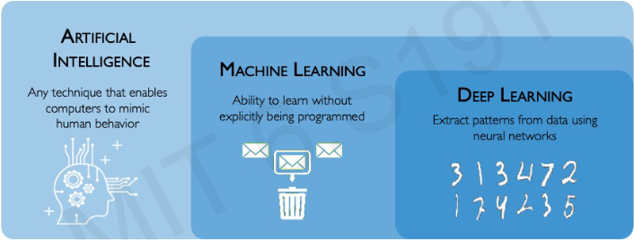
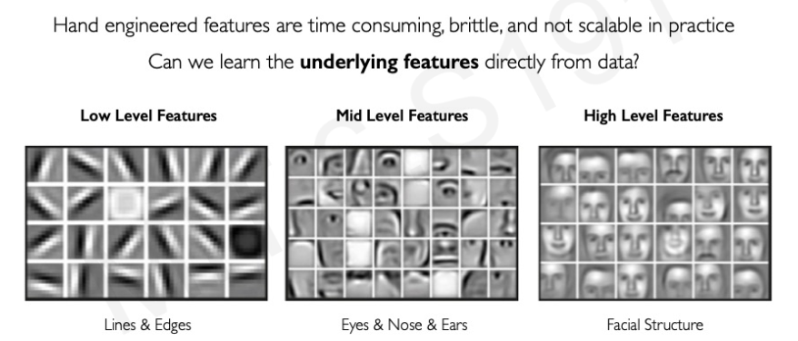
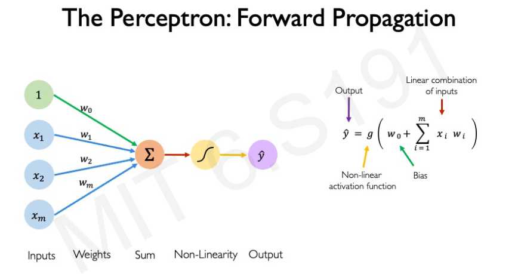
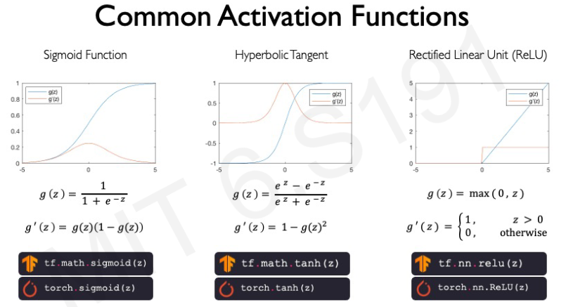
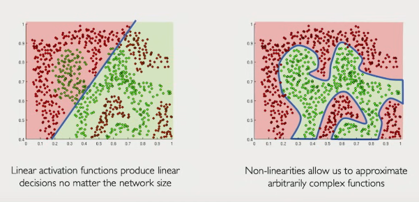

# Table of Contents
   [What is Deep Learning?](#what-is-deep-learning)
1. [The Perceptron](#1-the-perceptron)
2. [Building Neural Networks with Perceptrons](#2-building-neural-networks-with-perceptrons)
3. [Apply Neural Networks](#3-apply-neural-networks)
4. [Training Neural Networks](#4-training-neural-networks)
5. [Neural Networks in Practise: Optimisation](#5-neural-networks-in-practise-optimisation)
6. [Neural Networks in Practise: Mini-batches](#6-neural-networks-in-practise-mini-batches)
7. [Neural Networks in Practise: Overfitting](#7-neural-networks-in-practise-overfitting)

# What is Deep Learning?
**Intelligence** - an ability to process information to inform a future descision.  
An **Artificial intelligence** is just an algorithm, built to do exactly that same process.  
  
Generally speaking, DL is about teachning computers to **learn from raw data**.

Traditional machine learning usually defines sets of features, which are basically variables that represent the data in a structured way.  
Deep learning is about automatically figuring out what those features are.  
  
So, in deep learning process the algorithm would have to figure out all mentioned features in the most efficient way for itself.

# 1. The Perceptron
The perceptron (*a single neuron*) is a fundamental structural building block of every neural network.
## Forward propagation
Forward propagation or forward pass is the process of feeding input data through a neural network layer by layer, when output of each neuron is calculated starting from the input layer and moving towards an output layer.  

The formula can also be rewritten as the following:  
$\LARGE \hat{y} = g \left( w_0 + X^T W \right)$ where $\LARGE X = \begin{bmatrix} x_1 \\ \vdots \\ x_m \end{bmatrix}$ 
and $\LARGE W = \begin{bmatrix} w_1 \\ \vdots \\ w_m \end{bmatrix}$  
**Bias Term** ($W_0$) is a constant value added to the weighted sum of inputs to a neuron, shifting the activation function, providing flexibility and improving model accuracy.  

## Common activation functions

## Importance of activation functions
The point of activation functions is to **introduce non-linearities** to our model, because data in the real world is heavily non-linear.  

# 2. Building Neural Networks with Perceptrons
## The Perceptron: Simplified
## Multi Output Perceptron
## Single Layer Neural Network
## Deep Neural Network

# 3. Apply Neural Networks
## Example Probem: Will I pass this class?
## Quantifying Loss
## Empirical Loss
## Binary Cross Entropy Loss
## Mean Squared Error Loss

# 4. Training Neural Networks
## Loss Optimization
## Gradient Descent
## Computing Gradients: Backpropagation

# 5. Neural Networks in Practise: Optimisation
## Difficulties
## Setting the Learning Rate
## Adaptive Learning Rates
## Gradient Descent Algorithms

# 6. Neural Networks in Practise: Mini-batches
## Gradient Descent
## Stohastic Gradient Descent
## Mini-batches while training

# 7. Neural Networks in Practise: Overfitting
## The Problem of Overfitting
## Regularization

# Core review 